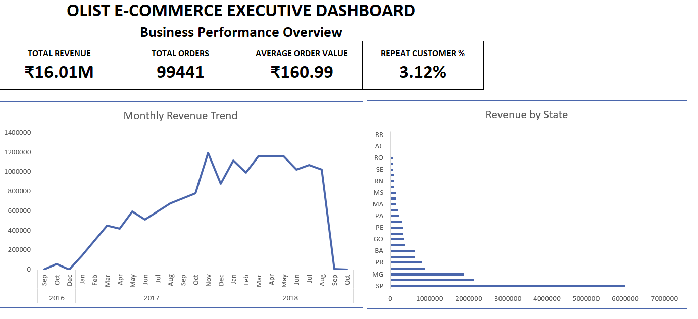
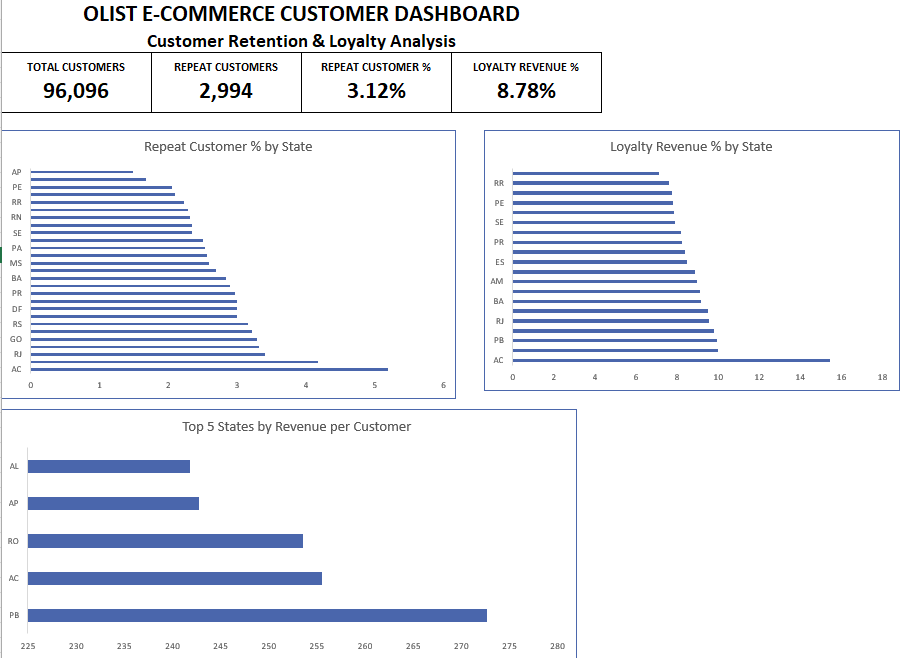
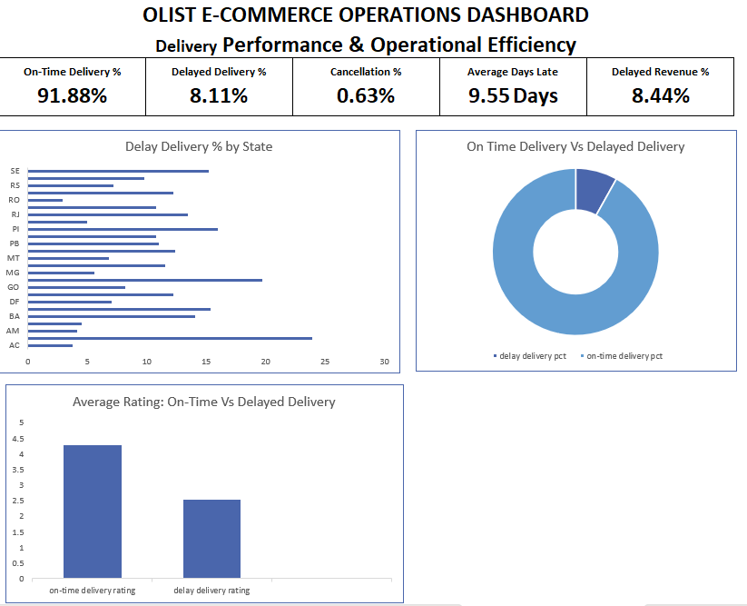
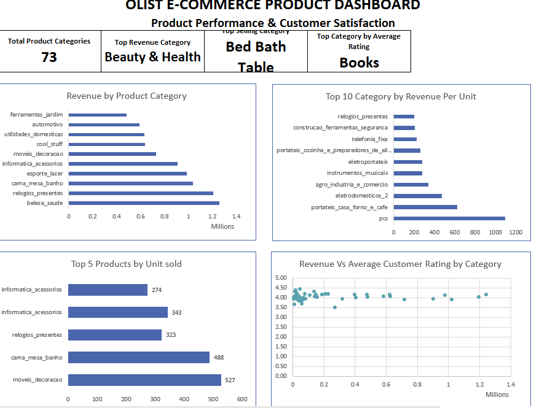
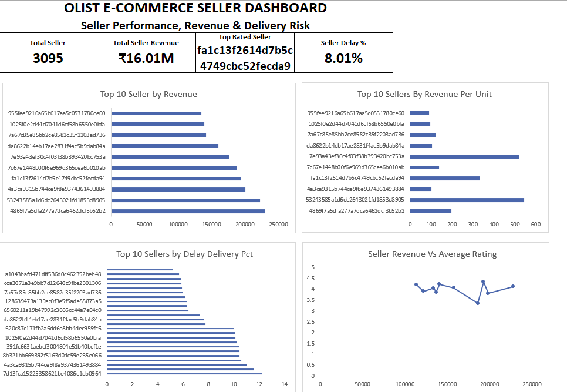
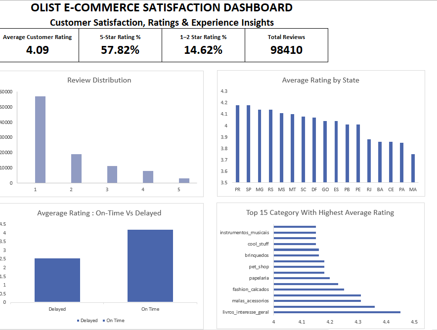

# Olist E-Commerce Business Analysis

## Business Analysis of 99K+ Orders Using PostgreSQL & Excel

An end-to-end e-commerce business analysis project focused on understanding revenue performance, customer retention, delivery operations, product performance, seller performance, and customer satisfaction.

The analysis uses PostgreSQL for data preparation and business analysis, followed by Excel dashboards for decision-oriented reporting.

---

## 1. Business Objective

The objective of this analysis was to answer key business questions across the Olist e-commerce marketplace:

- How is overall revenue performing?
- Which states contribute the most revenue?
- How strong is customer retention?
- How do delivery delays affect customer satisfaction?
- Which product categories generate the most revenue?
- Which sellers show higher revenue and delivery risk?
- What does the customer rating distribution reveal about satisfaction?

---

## 2. Dataset

The analysis uses the Brazilian Olist e-commerce dataset containing multiple interconnected business entities.

### Data Scale

- 99,441 orders
- 96,096 unique customers
- 3,095 sellers
- 73 product categories
- 112K+ order items
- 98K+ reviews

### Core Entities

- Orders
- Customers
- Order Items
- Products
- Sellers
- Payments
- Reviews

The tables were connected using primary/foreign-key relationships and analyzed as an integrated business dataset.

> Raw dataset files are not included in this repository due to repository size considerations.

---

## 3. Analytical Approach

### PostgreSQL

The analysis was performed using:

- Multi-table JOINs
- Aggregations
- GROUP BY
- CASE statements
- CTEs
- Window functions
- Date-based analysis
- Revenue calculations
- Customer-level analysis
- Seller-level analysis
- Delivery performance analysis

More than 30 business KPIs were developed across different analytical areas.

### Excel

The final analysis was converted into six decision-oriented dashboards:

1. Executive Dashboard
2. Customer Dashboard
3. Operations Dashboard
4. Product Dashboard
5. Seller Dashboard
6. Satisfaction Dashboard

---

# 4. Key Business Findings

## Overall Business Performance

- Total revenue: **₹16.01M**
- Total orders: **99,441**
- Average order value: **₹160.99**
- Repeat customer rate: **3.12%**

The low repeat-customer rate indicates a significant customer-retention opportunity.

---

## Customer Retention

Only **3.12%** of customers were identified as repeat customers, while these customers contributed **8.78% of total revenue**.

This indicates that although repeat customers represent a small customer base, they generate a disproportionately larger share of revenue.

**Business implication:** Customer retention and repeat-purchase strategies represent an important area for further investigation.

---

## Delivery & Customer Satisfaction

- On-time delivery: **91.88%**
- Delayed delivery: **8.11%**
- Average delay: **9.55 days**
- Delayed-order revenue: **8.44%**

Average customer rating:

- On-time orders: **4.30**
- Delayed orders: **2.57**

Delayed orders therefore show a substantial association with lower customer ratings.

**Business implication:** Delivery reliability should be treated as an important customer-experience metric.

---

## Product Performance

- 73 product categories were analyzed.
- **Beauty & Health** generated the highest category revenue.
- **Bed Bath Table** recorded the highest unit sales.
- **Books** had the highest average category rating in the analyzed dashboard.

The analysis also compared category revenue, units sold, revenue per unit, and customer ratings rather than evaluating product performance using revenue alone.

---

## Seller Performance

Seller performance was evaluated using:

- Revenue
- Revenue per unit
- Delivery delay percentage
- Average customer rating

The analysis showed that delivery delays alone did not fully explain differences in seller ratings.

Category mix showed a stronger association with rating differences in the analyzed seller data.

This should be treated as an analytical finding rather than a causal conclusion and would require further investigation.

---

## Customer Satisfaction

- Average customer rating: **4.09 / 5**
- 5-star ratings: **57.82%**
- 1–2-star ratings: **14.62%**
- Total reviews analyzed: **98,410**

The rating distribution provides a broader view of customer satisfaction beyond the overall average rating.

---

# 5. Dashboards

## Executive Dashboard

Business performance overview covering revenue, orders, AOV, repeat customers, monthly revenue trend, and state-level revenue.



---

## Customer Dashboard

Customer retention, repeat-customer behavior, loyalty revenue, and state-level customer economics.



---

## Operations Dashboard

Delivery performance, delays, cancellations, delayed revenue, and the relationship between delivery status and customer ratings.



---

## Product Dashboard

Category revenue, revenue per unit, units sold, and category-level customer ratings.



---

## Seller Dashboard

Seller revenue, revenue per unit, delivery risk, and seller-level rating analysis.



---

## Satisfaction Dashboard

Review distribution, state-level ratings, delivery-status ratings, and category-level satisfaction.



---

# 6. Project Structure

```text
olist-ecommerce-business-analysis/

├── case-study/
│   └── Olist_Ecommerce_Case_Study.docx
│
├── screenshots/
│   ├── executive_dashboard.png
│   ├── customer_dashboard.png
│   ├── operations_dashboard.png
│   ├── product_dashboard.png
│   ├── seller_dashboard.png
│   └── satisfaction_dashboard.png
│
├── sql/
│   ├── 01_table_creation.sql
│   ├── 02_executive_analysis.sql
│   ├── 03_customer_analysis.sql
│   ├── 04_operations_analysis.sql
│   ├── 05_product_analysis.sql
│   ├── 06_seller_analysis.sql
│   └── 07_satisfaction_analysis.sql
│
├── Excel/
│   └── Olist_Business_Analysis.xlsx
│
├── data/
│   └── README.md
│
├── .gitignore
└── README.md
```
